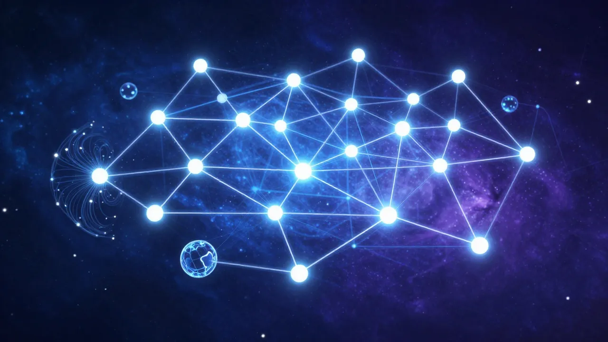
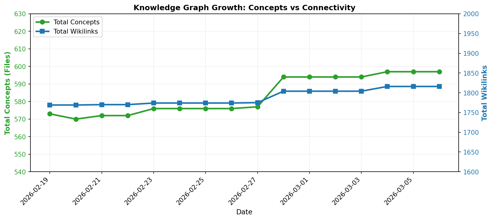

# Data knowledge graph



## Daily Stats



A personal knowledge graph containing **572 interconnected concepts** in data science, machine learning, and AI. Built as an [Obsidian](https://obsidian.md/) vault with typed relationships, this graph can serve as the foundation for a **data ontology**.
## Structure

Each concept is a markdown file with:
- **YAML frontmatter** defining typed relationships (`partOf`, `uses`, `subclass of`, etc.)
- **Definition/description** of the concept
- **Wiki-links** (`[[concept]]`) connecting to related terms

```yaml
# Example: Knowledge graph.md
---
uses:
  - "[[Ontology]]"
  - "[[Taxonomy]]"
subclass of:
  - "[[knowledge base]]"
  - "[[labeled directed graph]]"
studied in:
  - "[[Ontology engineering]]"
---
```

## Topics covered

- **Machine Learning**: Algorithms, model training, evaluation metrics, feature engineering
- **Data Engineering**: Pipelines, data lineage, ETL, data quality
- **NLP & LLMs**: Embeddings, RAG, transformers, prompt engineering
- **MLOps**: Model versioning, deployment, monitoring, drift detection
- **Data Privacy**: PII management, FERPA, compliance
- **Knowledge Representation**: Ontologies, taxonomies, knowledge graphs

## Potential uses as a data ontology

1. Semantic search & retrieval

Use the typed relationships to build a **GraphRAG system** that navigates concepts through their semantic connections rather than just keyword matching.

2. Data catalog enrichment

Import this ontology into a data catalog to provide standardized terminology and hierarchical classification for data assets across an organization.

3. Onboarding & training

Serve as an interactive learning resource for data teams, with concept definitions and relationship paths showing how ideas connect.

4. LLM grounding

Provide structured domain knowledge to LLMs for more accurate, consistent responses about data concepts—reducing hallucination through explicit relationship constraints.

5. Metadata schema design

Use the relationship types (`partOf`, `uses`, `subclass of`) as a blueprint for designing metadata schemas in data platforms.

6. Knowledge graph construction

Convert this vault into a formal knowledge graph (Neo4j, RDF) by:
- Extracting nodes from file names
- Parsing frontmatter for typed edges
- Enriching with definitions as node properties

7. Concept disambiguation

Establish canonical definitions and relationships to resolve ambiguity when different teams use data terminology inconsistently.

## Usage

Open the `graph/` folder in [Obsidian](https://obsidian.md/) to explore the knowledge graph visually using the Graph View.

To convert to other formats:
- **Neo4j**: Parse markdown frontmatter into Cypher CREATE statements
- **RDF/OWL**: Map relationship types to predicates
- **JSON-LD**: Export as linked data for web interoperability


