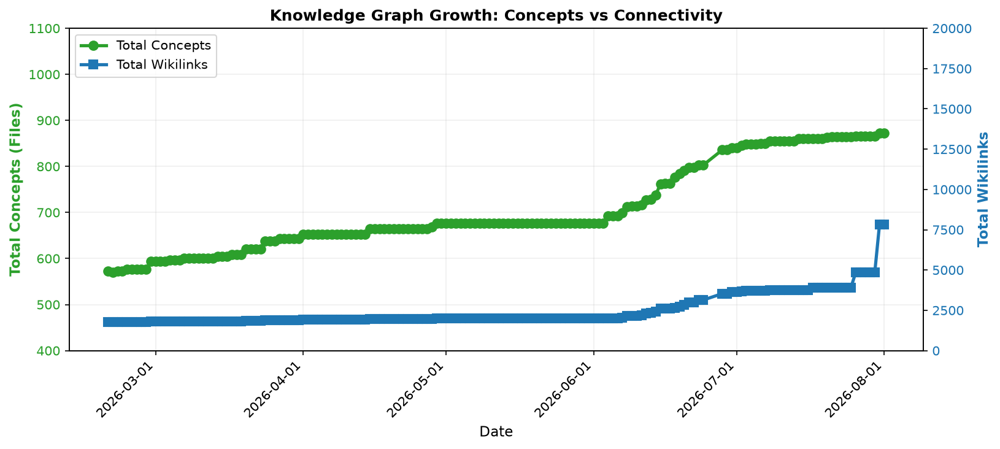

# Data knowledge graph

### Daily Stats



A personal knowledge graph containing **865 interconnected concepts** in data science, machine learning, and AI. Built as an [Obsidian](https://obsidian.md/) vault with typed relationships, this graph can serve as the foundation for a **data ontology**.

## Structure

Each concept is a markdown file with:
- **YAML frontmatter** defining typed relationships (`partOf`, `uses`, `subclass of`, etc.)
- **Definition/description** of the concept
- **Wiki-links** (`[[concept]]`) connecting to related terms

```yaml
# Example: Knowledge graph.md
---
uses:
  - "[[Ontology]]"
  - "[[Taxonomy]]"
subclass of:
  - "[[knowledge base]]"
  - "[[labeled directed graph]]"
studied in:
  - "[[Ontology engineering]]"
---
```

## Topics covered

- **Machine Learning**: Algorithms, model training, evaluation metrics, feature engineering
- **Data Engineering**: Pipelines, data lineage, ETL, data quality
- **NLP & LLMs**: Embeddings, RAG, transformers, prompt engineering
- **MLOps**: Model versioning, deployment, monitoring, drift detection
- **Data Privacy**: PII management, FERPA, compliance
- **Knowledge Representation**: Ontologies, taxonomies, knowledge graphs

## Potential uses as a data ontology

1. Semantic search & retrieval

Use the typed relationships to build a **GraphRAG system** that navigates concepts through their semantic connections rather than just keyword matching.

2. Data catalog enrichment

Import this ontology into a data catalog to provide standardized terminology and hierarchical classification for data assets across an organization.

3. Onboarding & training

Serve as an interactive learning resource for data teams, with concept definitions and relationship paths showing how ideas connect.

4. LLM grounding

Provide structured domain knowledge to LLMs for more accurate, consistent responses about data concepts—reducing hallucination through explicit relationship constraints.

5. Metadata schema design

Use the relationship types (`partOf`, `uses`, `subclass of`) as a blueprint for designing metadata schemas in data platforms.

6. Knowledge graph construction

Convert this vault into a formal knowledge graph (Neo4j, RDF) by:
- Extracting nodes from file names
- Parsing frontmatter for typed edges
- Enriching with definitions as node properties

7. Concept disambiguation

Establish canonical definitions and relationships to resolve ambiguity when different teams use data terminology inconsistently.

## Taxonomy — SKOS Broader/Narrower Hierarchy

The graph uses `broader:` in YAML frontmatter to encode [SKOS](https://www.w3.org/2004/02/skos/)-style hierarchical relationships. **701 of 866 concepts** (80.9%) are classified into a `broader` parent, forming a taxonomy with 73 root concepts and up to 8 nesting levels.

The `broader:` property means "this concept is a subtype/subclass/instance of the parent" — equivalent to `skos:broader`. Reading in the opposite direction gives `skos:narrower`.

### Full taxonomy

- [agent observability](graph/agent%20observability.md)
  - [AgentOps](graph/AgentOps.md)
  - [LLM Observability](graph/LLM%20Observability.md)
    - [Langfuse](graph/Langfuse.md)
- [Agile approach](graph/Agile%20approach.md)
  - [Daily stand-ups](graph/Daily%20stand-ups.md)
  - [Demo sessions](graph/Demo%20sessions.md)
  - [Product owner](graph/Product%20owner.md)
  - [Sprint planning](graph/Sprint%20planning.md)
- [AI](graph/AI.md)
  - [AI engineering](graph/AI%20engineering.md)
  - [AI Hierarchy of needs](graph/AI%20Hierarchy%20of%20needs.md)
  - [AI Proof detection model](graph/AI%20Proof%20detection%20model.md)
  - [AI stack](graph/AI%20stack.md)
  - [Artificial Intelligence (AI)](graph/Artificial%20Intelligence%20%28AI%29.md)
    - [Agentic System](graph/Agentic%20System.md)
      - [action module](graph/action%20module.md)
      - [agency](graph/agency.md)
      - [agent harness](graph/agent%20harness.md)
      - [agent identity](graph/agent%20identity.md)
      - [agent role type](graph/agent%20role%20type.md)
      - [Autonomy](graph/Autonomy.md)
      - [claude code](graph/claude%20code.md)
      - [claude managed agents](graph/claude%20managed%20agents.md)
      - [comparag agent](graph/comparag%20agent.md)
      - [context mode](graph/context%20mode.md)
      - [Human-in-the-loop](graph/Human-in-the-loop.md)
      - [Model Context Protocol (MCP)](graph/Model%20Context%20Protocol%20%28MCP%29.md)
        - [MCP host](graph/MCP%20host.md)
        - [MCP server](graph/MCP%20server.md)
      - [ReAct data agent](graph/ReAct%20data%20agent.md)
      - [ReAct mode](graph/ReAct%20mode.md)
      - [search module](graph/search%20module.md)
      - [Subagent](graph/Subagent.md)
      - [Tool arena](graph/Tool%20arena.md)
      - [Tool Assignment Gate](graph/Tool%20Assignment%20Gate.md)
      - [Toolkits](graph/Toolkits.md)
      - [Tools](graph/Tools.md)
    - [compound AI systems](graph/compound%20AI%20systems.md)
    - [computer vision](graph/computer%20vision.md)
      - [Facial recognition](graph/Facial%20recognition.md)
    - [connexionism](graph/connexionism.md)
    - [Expert systems](graph/Expert%20systems.md)
    - [Narrow AI](graph/Narrow%20AI.md)
    - [Natural Language Processing](graph/Natural%20Language%20Processing.md)
      - [Bag of words](graph/Bag%20of%20words.md)
      - [Embeddings](graph/Embeddings.md)
        - [embedding](graph/embedding.md)
        - [Embeddings models](graph/Embeddings%20models.md)
        - [latent space](graph/latent%20space.md)
        - [vectorization](graph/vectorization.md)
        - [Word embeddings](graph/Word%20embeddings.md)
      - [Language modeling](graph/Language%20modeling.md)
        - [autoregressive language models](graph/autoregressive%20language%20models.md)
          - [GPT2](graph/GPT2.md)
        - [Large Language Model](graph/Large%20Language%20Model.md)
          - [AI prompt](graph/AI%20prompt.md)
            - [chain-of-thought](graph/chain-of-thought.md)
            - [Prompt Identity](graph/Prompt%20Identity.md)
            - [Prompt Optimization Techniques](graph/Prompt%20Optimization%20Techniques.md)
            - [Prompt Template Info](graph/Prompt%20Template%20Info.md)
            - [Prompt Template Types](graph/Prompt%20Template%20Types.md)
            - [Prompt templates](graph/Prompt%20templates.md)
            - [Prompt-based techniques](graph/Prompt-based%20techniques.md)
            - [prompts](graph/prompts.md)
            - [system prompt](graph/system%20prompt.md)
          - [chat engines](graph/chat%20engines.md)
          - [chat modes](graph/chat%20modes.md)
          - [Hallucination](graph/Hallucination.md)
          - [In-Context Learning](graph/In-Context%20Learning.md)
          - [LLaMA](graph/LLaMA.md)
          - [LLM Models](graph/LLM%20Models.md)
          - [LLM Path Extractors](graph/LLM%20Path%20Extractors.md)
          - [moderation](graph/moderation.md)
          - [Ollama](graph/Ollama.md)
          - [RAG (Retrieval-Augmented Generation)](graph/RAG%20%28Retrieval-Augmented%20Generation%29.md)
            - [condense_plus_context](graph/condense_plus_context.md)
            - [condense_question](graph/condense_question.md)
            - [Hypothetical Document Embeddings (HyDE)](graph/Hypothetical%20Document%20Embeddings%20%28HyDE%29.md)
            - [Retrieval Depth](graph/Retrieval%20Depth.md)
            - [Retriever](graph/Retriever.md)
            - [Retriever Orchestration](graph/Retriever%20Orchestration.md)
            - [vanilla RAG design](graph/vanilla%20RAG%20design.md)
          - [Retrieval Augmented Generation](graph/Retrieval%20Augmented%20Generation.md)
        - [masked language models](graph/masked%20language%20models.md)
          - [BERT](graph/BERT.md)
            - [camemBERT](graph/camemBERT.md)
      - [Sentiment analysis](graph/Sentiment%20analysis.md)
      - [token](graph/token.md)
      - [Tokenizer](graph/Tokenizer.md)
    - [Symbolism](graph/Symbolism.md)
  - [claude cowork](graph/claude%20cowork.md)
  - [compilatio IA](graph/compilatio%20IA.md)
  - [Fiabilite de compilatio](graph/Fiabilite%20de%20compilatio.md)
  - [HGR-AI-1](graph/HGR-AI-1.md)
  - [Man-Computer Symbiosis](graph/Man-Computer%20Symbiosis.md)
  - [The Shift from Models to Compound AI Systems](graph/The%20Shift%20from%20Models%20to%20Compound%20AI%20Systems.md)
- [Algorithm](graph/Algorithm.md)
  - [Algorithm selection](graph/Algorithm%20selection.md)
  - [Greediness](graph/Greediness.md)
  - [Non-parametric algorithms](graph/Non-parametric%20algorithms.md)
  - [selection](graph/selection.md)
- [Automation](graph/Automation.md)
  - [Automation framework](graph/Automation%20framework.md)
  - [office automation](graph/office%20automation.md)
- [Business understanding](graph/Business%20understanding.md)
  - [define success](graph/define%20success.md)
  - [Problem framing](graph/Problem%20framing.md)
- [Centrality](graph/Centrality.md)
  - [betweenness centrality](graph/betweenness%20centrality.md)
  - [closeness centrality](graph/closeness%20centrality.md)
  - [Degree centrality](graph/Degree%20centrality.md)
  - [Eigenvector centrality](graph/Eigenvector%20centrality.md)
- [clause](graph/clause.md)
  - [clause classification heuristic](graph/clause%20classification%20heuristic.md)
  - [exclusion clause](graph/exclusion%20clause.md)
  - [force majeure](graph/force%20majeure.md)
  - [non-compete clause](graph/non-compete%20clause.md)
- [Clustering](graph/Clustering.md)
  - [Elbow method](graph/Elbow%20method.md)
  - [K-Means Clustering](graph/K-Means%20Clustering.md)
- [Combinatorics](graph/Combinatorics.md)
  - [graph theory](graph/graph%20theory.md)
  - [probability](graph/probability.md)
- [combinatorics](graph/combinatorics.md)
  - [combination](graph/combination.md)
    - [chainrings](graph/chainrings.md)
    - [Shifter](graph/Shifter.md)
    - [Tooth](graph/Tooth.md)
  - [Unary operation](graph/Unary%20operation.md)
- [communicate uncertainty](graph/communicate%20uncertainty.md)
  - [confidence presentation](graph/confidence%20presentation.md)
- [Confusion Matrix](graph/Confusion%20Matrix.md)
  - [False Negative (FN)](graph/False%20Negative%20%28FN%29.md)
  - [False Positive (FP)](graph/False%20Positive%20%28FP%29.md)
  - [True Negative (TN)](graph/True%20Negative%20%28TN%29.md)
  - [True Positive (TP)](graph/True%20Positive%20%28TP%29.md)
- [Containerization (computing)](graph/Containerization%20%28computing%29.md)
  - [container](graph/container.md)
  - [Docker](graph/Docker.md)
    - [Docker images](graph/Docker%20images.md)
- [contract](graph/contract.md)
  - [compliant privacy policy](graph/compliant%20privacy%20policy.md)
  - [liability](graph/liability.md)
  - [model contract](graph/model%20contract.md)
  - [Rider](graph/Rider.md)
- [control theory](graph/control%20theory.md)
  - [Damping](graph/Damping.md)
  - [Inertia](graph/Inertia.md)
  - [James Clerk Maxwell](graph/James%20Clerk%20Maxwell.md)
  - [state observer](graph/state%20observer.md)
- [Data augmentation](graph/Data%20augmentation.md)
  - [augmentation](graph/augmentation.md)
- [Data science team](graph/Data%20science%20team.md)
  - [Data engineer](graph/Data%20engineer.md)
  - [Data scientist](graph/Data%20scientist.md)
  - [Engineering team](graph/Engineering%20team.md)
  - [Machine learning engineer](graph/Machine%20learning%20engineer.md)
  - [Software engineer](graph/Software%20engineer.md)
- [data understanding](graph/data%20understanding.md)
  - [Exploratory Data Analysis](graph/Exploratory%20Data%20Analysis.md)
    - [High-intent data discovery](graph/High-intent%20data%20discovery.md)
- [data visualization](graph/data%20visualization.md)
  - [Dashboard](graph/Dashboard.md)
  - [Pictorial fraction chart](graph/Pictorial%20fraction%20chart.md)
  - [Preston curve](graph/Preston%20curve.md)
  - [statistical graphics](graph/statistical%20graphics.md)
- [de facto](graph/de%20facto.md)
  - [de facto standard](graph/de%20facto%20standard.md)
- [Decision support](graph/Decision%20support.md)
  - [decision making](graph/decision%20making.md)
  - [Human prediction](graph/Human%20prediction.md)
  - [judgment](graph/judgment.md)
- [Deep learning](graph/Deep%20learning.md)
  - [artificial neural network](graph/artificial%20neural%20network.md)
    - [artificial neuron](graph/artificial%20neuron.md)
    - [autoencoder](graph/autoencoder.md)
    - [Backpropagation](graph/Backpropagation.md)
      - [Gradient](graph/Gradient.md)
    - [biological neural network](graph/biological%20neural%20network.md)
    - [Convolutional neural networks](graph/Convolutional%20neural%20networks.md)
      - [Convolutional layers](graph/Convolutional%20layers.md)
    - [Embedding network](graph/Embedding%20network.md)
    - [Forward propagation](graph/Forward%20propagation.md)
    - [Hidden states](graph/Hidden%20states.md)
    - [multilayer perceptron](graph/multilayer%20perceptron.md)
    - [neuron layer](graph/neuron%20layer.md)
    - [ReLU activation function](graph/ReLU%20activation%20function.md)
    - [Sigmoid function](graph/Sigmoid%20function.md)
    - [Weights](graph/Weights.md)
  - [foundation model](graph/foundation%20model.md)
    - [multimodal model](graph/multimodal%20model.md)
    - [tabular foundation model](graph/tabular%20foundation%20model.md)
      - [TabPFN](graph/TabPFN.md)
  - [Keras](graph/Keras.md)
  - [Transfer learning](graph/Transfer%20learning.md)
  - [Transformers](graph/Transformers.md)
    - [attention weights](graph/attention%20weights.md)
    - [Decoder-only](graph/Decoder-only.md)
    - [Encoder-only](graph/Encoder-only.md)
- [Dividual](graph/Dividual.md)
  - [Gilles Deleuze](graph/Gilles%20Deleuze.md)
- [Domain](graph/Domain.md)
  - [Subdomain](graph/Subdomain.md)
- [elicitation](graph/elicitation.md)
  - [Dialogue](graph/Dialogue.md)
  - [elicitation interview](graph/elicitation%20interview.md)
  - [Pierre Vermersch](graph/Pierre%20Vermersch.md)
  - [Socratic](graph/Socratic.md)
    - [Socrates](graph/Socrates.md)
- [Evaluation](graph/Evaluation.md)
  - [Hindsight scenario testing](graph/Hindsight%20scenario%20testing.md)
- [evaluation](graph/evaluation.md)
  - [Cross validation](graph/Cross%20validation.md)
    - [N-Fold Cross Validation](graph/N-Fold%20Cross%20Validation.md)
  - [detection tool performance](graph/detection%20tool%20performance.md)
  - [Evaluation dataset](graph/Evaluation%20dataset.md)
  - [Evaluation metrics](graph/Evaluation%20metrics.md)
    - [accuracy](graph/accuracy.md)
    - [coefficient of determination](graph/coefficient%20of%20determination.md)
    - [confusion matrix](graph/confusion%20matrix.md)
    - [F1 Score](graph/F1%20Score.md)
    - [False Positive Rate](graph/False%20Positive%20Rate.md)
    - [LLM Metrics](graph/LLM%20Metrics.md)
    - [Perplexity](graph/Perplexity.md)
    - [Precision](graph/Precision.md)
    - [Recall](graph/Recall.md)
    - [Receiver Operating Characteristic curve](graph/Receiver%20Operating%20Characteristic%20curve.md)
    - [Regression Error Metrics](graph/Regression%20Error%20Metrics.md)
      - [Mean Absolute Error](graph/Mean%20Absolute%20Error.md)
      - [Mean Absolute Percent Error](graph/Mean%20Absolute%20Percent%20Error.md)
      - [Sum of Squared Error (SSE)](graph/Sum%20of%20Squared%20Error%20%28SSE%29.md)
    - [True Positive Rate (Recall)](graph/True%20Positive%20Rate%20%28Recall%29.md)
- [Fairness](graph/Fairness.md)
  - [accountable AI](graph/accountable%20AI.md)
  - [bias](graph/bias.md)
    - [Feedback loop bias](graph/Feedback%20loop%20bias.md)
    - [Historical bias](graph/Historical%20bias.md)
    - [recall bias](graph/recall%20bias.md)
  - [Data privacy](graph/Data%20privacy.md)
    - [Data privacy laws](graph/Data%20privacy%20laws.md)
      - [Family Educational Rights and Privacy Act (FERPA)](graph/Family%20Educational%20Rights%20and%20Privacy%20Act%20%28FERPA%29.md)
      - [Gramm-Leach-Bliley Act (GLBA)](graph/Gramm-Leach-Bliley%20Act%20%28GLBA%29.md)
    - [Fair Information Practices](graph/Fair%20Information%20Practices.md)
    - [Financial Privacy](graph/Financial%20Privacy.md)
    - [Management of PII](graph/Management%20of%20PII.md)
    - [Medical Data Privacy](graph/Medical%20Data%20Privacy.md)
      - [Protected Health Information (PHI)](graph/Protected%20Health%20Information%20%28PHI%29.md)
    - [Privacy by design](graph/Privacy%20by%20design.md)
    - [Rights of Individuals](graph/Rights%20of%20Individuals.md)
    - [Sensitive Information](graph/Sensitive%20Information.md)
    - [Technological privacy](graph/Technological%20privacy.md)
  - [Ethical checklist](graph/Ethical%20checklist.md)
  - [Ethical risks](graph/Ethical%20risks.md)
  - [Fair AI](graph/Fair%20AI.md)
  - [Individual fairness](graph/Individual%20fairness.md)
  - [Transparency](graph/Transparency.md)
    - [Interpretability](graph/Interpretability.md)
      - [Counterfactual explanations](graph/Counterfactual%20explanations.md)
      - [Local Interpretable Model-Agnostic Explanations (LIME)](graph/Local%20Interpretable%20Model-Agnostic%20Explanations%20%28LIME%29.md)
      - [Shapley Additive Explanations (SHAP)](graph/Shapley%20Additive%20Explanations%20%28SHAP%29.md)
- [Functions](graph/Functions.md)
  - [Pipe function](graph/Pipe%20function.md)
- [Graph algorithm](graph/Graph%20algorithm.md)
  - [centrality](graph/centrality.md)
  - [community detection](graph/community%20detection.md)
  - [Dijkstra's shortest path](graph/Dijkstra%27s%20shortest%20path.md)
  - [Node similarity](graph/Node%20similarity.md)
- [Graph theory](graph/Graph%20theory.md)
  - [adjacency matrix](graph/adjacency%20matrix.md)
  - [Arc](graph/Arc.md)
  - [complete graph](graph/complete%20graph.md)
  - [Edges](graph/Edges.md)
  - [Graph network analysis](graph/Graph%20network%20analysis.md)
    - [Social network analysis](graph/Social%20network%20analysis.md)
  - [Graph projection](graph/Graph%20projection.md)
  - [Heterogeneous graph](graph/Heterogeneous%20graph.md)
  - [Multipartite graph](graph/Multipartite%20graph.md)
  - [Network graph](graph/Network%20graph.md)
  - [node](graph/node.md)
  - [Path](graph/Path.md)
  - [Property graph model](graph/Property%20graph%20model.md)
- [heuristic](graph/heuristic.md)
  - [Heuristics](graph/Heuristics.md)
  - [Lean Logic](graph/Lean%20Logic.md)
  - [Occam's rasor](graph/Occam%27s%20rasor.md)
- [Infrastructure](graph/Infrastructure.md)
  - [authentication protocol](graph/authentication%20protocol.md)
    - [OAuth](graph/OAuth.md)
    - [SSH Key](graph/SSH%20Key.md)
  - [central processing unit](graph/central%20processing%20unit.md)
  - [cloud computing](graph/cloud%20computing.md)
  - [communication protocol](graph/communication%20protocol.md)
  - [Datawarehouse](graph/Datawarehouse.md)
  - [Dedicated server](graph/Dedicated%20server.md)
  - [Deploy](graph/Deploy.md)
    - [Shadow releasing](graph/Shadow%20releasing.md)
  - [Environment](graph/Environment.md)
  - [Fault tolerance](graph/Fault%20tolerance.md)
  - [Graphics processing unit](graph/Graphics%20processing%20unit.md)
  - [Horizontal scaling](graph/Horizontal%20scaling.md)
  - [HTTP](graph/HTTP.md)
    - [HTTP 403](graph/HTTP%20403.md)
  - [IAM execution role](graph/IAM%20execution%20role.md)
  - [Layered architecture](graph/Layered%20architecture.md)
  - [Memory](graph/Memory.md)
  - [Message-oriented middleware](graph/Message-oriented%20middleware.md)
  - [modularity](graph/modularity.md)
  - [NoSQL database](graph/NoSQL%20database.md)
  - [persistence](graph/persistence.md)
  - [Personal computing resources](graph/Personal%20computing%20resources.md)
  - [Service-oriented architecture (SOA)](graph/Service-oriented%20architecture%20%28SOA%29.md)
  - [Shards](graph/Shards.md)
  - [Shared computing resources](graph/Shared%20computing%20resources.md)
  - [SSH Agent](graph/SSH%20Agent.md)
  - [Virtualization](graph/Virtualization.md)
    - [containerization (computing)](graph/containerization%20%28computing%29.md)
  - [VRAM](graph/VRAM.md)
- [intellectual work](graph/intellectual%20work.md)
  - [creative work](graph/creative%20work.md)
- [International (Nice) Classification of Goods and Services](graph/International%20%28Nice%29%20Classification%20of%20Goods%20and%20Services.md)
  - [Good and services classes](graph/Good%20and%20services%20classes.md)
- [Kernel](graph/Kernel.md)
  - [Radial Basis Function Kernel](graph/Radial%20Basis%20Function%20Kernel.md)
- [knowledge graph](graph/knowledge%20graph.md)
  - [adar-Adamic index](graph/adar-Adamic%20index.md)
  - [alias](graph/alias.md)
  - [context graph](graph/context%20graph.md)
  - [CYPHER](graph/CYPHER.md)
  - [graph hop](graph/graph%20hop.md)
  - [graphs](graph/graphs.md)
  - [inferred from attribute of entity](graph/inferred%20from%20attribute%20of%20entity.md)
  - [Ingoing relationships](graph/Ingoing%20relationships.md)
  - [list of values as qualifiers](graph/list%20of%20values%20as%20qualifiers.md)
  - [Object](graph/Object.md)
  - [Outgoing relationships](graph/Outgoing%20relationships.md)
  - [Properties](graph/Properties.md)
  - [Property](graph/Property.md)
  - [Relationship aggregation](graph/Relationship%20aggregation.md)
  - [Relationship quality](graph/Relationship%20quality.md)
  - [Text2Cypher](graph/Text2Cypher.md)
- [knowledge organization system](graph/knowledge%20organization%20system.md)
  - [concept](graph/concept.md)
  - [controlled vocabulary](graph/controlled%20vocabulary.md)
  - [model vocabulary](graph/model%20vocabulary.md)
  - [Ontology](graph/Ontology.md)
    - [abstract entity](graph/abstract%20entity.md)
    - [ontology engineering](graph/ontology%20engineering.md)
  - [organizing principles](graph/organizing%20principles.md)
  - [subject heading](graph/subject%20heading.md)
  - [taxonomy](graph/taxonomy.md)
    - [classification](graph/classification.md)
    - [economic taxonomy](graph/economic%20taxonomy.md)
  - [thesaurus](graph/thesaurus.md)
- [LLM output evaluation](graph/LLM%20output%20evaluation.md)
  - [LLM-as-judges](graph/LLM-as-judges.md)
- [machine learning](graph/machine%20learning.md)
  - [AutoML](graph/AutoML.md)
  - [Edge ML](graph/Edge%20ML.md)
  - [Federated learning](graph/Federated%20learning.md)
  - [Hyperparameters](graph/Hyperparameters.md)
    - [Learning rate](graph/Learning%20rate.md)
  - [loss function](graph/loss%20function.md)
  - [ML system](graph/ML%20system.md)
    - [best-classification-rate AI detection system](graph/best-classification-rate%20AI%20detection%20system.md)
    - [cold start problem](graph/cold%20start%20problem.md)
    - [Excessive latency](graph/Excessive%20latency.md)
    - [machine learning systems](graph/machine%20learning%20systems.md)
    - [ML system design process](graph/ML%20system%20design%20process.md)
    - [ML System failures](graph/ML%20System%20failures.md)
    - [Nano-precision detection system](graph/Nano-precision%20detection%20system.md)
    - [Reproducibility](graph/Reproducibility.md)
  - [Optimizer algorithm](graph/Optimizer%20algorithm.md)
    - [Gradient descent](graph/Gradient%20descent.md)
      - [Batch gradient descent](graph/Batch%20gradient%20descent.md)
      - [Mini-batch gradient descent](graph/Mini-batch%20gradient%20descent.md)
  - [Regularization](graph/Regularization.md)
  - [Reinforcement Learning](graph/Reinforcement%20Learning.md)
  - [supervised learning](graph/supervised%20learning.md)
    - [Decision tree](graph/Decision%20tree.md)
      - [Random forest](graph/Random%20forest.md)
        - [Bootstrap aggregating (bagging)](graph/Bootstrap%20aggregating%20%28bagging%29.md)
      - [Recursive tree building](graph/Recursive%20tree%20building.md)
      - [Regression trees](graph/Regression%20trees.md)
      - [Tree depth](graph/Tree%20depth.md)
    - [K-Nearest Neighbor algorithm](graph/K-Nearest%20Neighbor%20algorithm.md)
      - [K-Nearest neighbor regressor](graph/K-Nearest%20neighbor%20regressor.md)
    - [Naive Bayes Classifier](graph/Naive%20Bayes%20Classifier.md)
    - [Support Vector Machine](graph/Support%20Vector%20Machine.md)
  - [training algorithm](graph/training%20algorithm.md)
  - [Unsupervised Learning](graph/Unsupervised%20Learning.md)
    - [clustering](graph/clustering.md)
- [machine learning projects](graph/machine%20learning%20projects.md)
  - [CRISP-DM Process](graph/CRISP-DM%20Process.md)
    - [Data preparation](graph/Data%20preparation.md)
      - [feature engineering](graph/feature%20engineering.md)
        - [Determine feature set](graph/Determine%20feature%20set.md)
        - [feature selection](graph/feature%20selection.md)
          - [Embedded methods](graph/Embedded%20methods.md)
          - [Filter methods](graph/Filter%20methods.md)
          - [Principal Component Analysis](graph/Principal%20Component%20Analysis.md)
          - [Wrapper methods](graph/Wrapper%20methods.md)
      - [Label encoding](graph/Label%20encoding.md)
      - [Min-max normalization](graph/Min-max%20normalization.md)
      - [One-hot encoding](graph/One-hot%20encoding.md)
      - [Split data](graph/Split%20data.md)
        - [Test data set](graph/Test%20data%20set.md)
      - [Tidy Data](graph/Tidy%20Data.md)
      - [Validate data](graph/Validate%20data.md)
      - [Z-Score normalization](graph/Z-Score%20normalization.md)
    - [Deployment](graph/Deployment.md)
      - [Inference](graph/Inference.md)
        - [backward chaining](graph/backward%20chaining.md)
        - [Batch prediction](graph/Batch%20prediction.md)
        - [causal inference](graph/causal%20inference.md)
          - [Joshua Pearl](graph/Joshua%20Pearl.md)
          - [The Book of Why](graph/The%20Book%20of%20Why.md)
        - [Inference engine](graph/Inference%20engine.md)
        - [Inference pipeline](graph/Inference%20pipeline.md)
        - [Online prediction](graph/Online%20prediction.md)
    - [Evaluate results](graph/Evaluate%20results.md)
    - [Explore the data](graph/Explore%20the%20data.md)
    - [Gather data](graph/Gather%20data.md)
    - [Identify factors](graph/Identify%20factors.md)
    - [modeling](graph/modeling.md)
    - [Prepare for modeling](graph/Prepare%20for%20modeling.md)
    - [Problem definition](graph/Problem%20definition.md)
    - [Test solution](graph/Test%20solution.md)
- [Metric](graph/Metric.md)
  - [business impact](graph/business%20impact.md)
  - [Information Gain (IG)](graph/Information%20Gain%20%28IG%29.md)
  - [Learning curve](graph/Learning%20curve.md)
  - [Margin](graph/Margin.md)
  - [measure](graph/measure.md)
  - [r2](graph/r2.md)
  - [reach](graph/reach.md)
  - [Similarity scores](graph/Similarity%20scores.md)
  - [Threshold value](graph/Threshold%20value.md)
- [ML models](graph/ML%20models.md)
  - [Decoders model](graph/Decoders%20model.md)
  - [feature](graph/feature.md)
  - [Feature bagging](graph/Feature%20bagging.md)
  - [Inherent error](graph/Inherent%20error.md)
  - [Instructor model](graph/Instructor%20model.md)
  - [Linear models](graph/Linear%20models.md)
    - [Linear regression models](graph/Linear%20regression%20models.md)
    - [Logistic regression](graph/Logistic%20regression.md)
  - [Machine Leaning Baseline](graph/Machine%20Leaning%20Baseline.md)
  - [Neural network models](graph/Neural%20network%20models.md)
  - [Offline models](graph/Offline%20models.md)
  - [Online models](graph/Online%20models.md)
  - [optimizer](graph/optimizer.md)
  - [other-losses](graph/other-losses.md)
  - [parameter](graph/parameter.md)
  - [prediction](graph/prediction.md)
    - [Target's pregnancy prediction](graph/Target%27s%20pregnancy%20prediction.md)
  - [Support vector](graph/Support%20vector.md)
  - [Target](graph/Target.md)
  - [Train loss](graph/Train%20loss.md)
- [Model fit](graph/Model%20fit.md)
  - [Overfitting](graph/Overfitting.md)
  - [Underfitting](graph/Underfitting.md)
- [Model maintenance](graph/Model%20maintenance.md)
  - [ML system monitoring](graph/ML%20system%20monitoring.md)
    - [concept drift](graph/concept%20drift.md)
    - [Data drift](graph/Data%20drift.md)
  - [Model decay](graph/Model%20decay.md)
  - [Model registry](graph/Model%20registry.md)
  - [model versioning](graph/model%20versioning.md)
  - [Retraining](graph/Retraining.md)
  - [Scheduled retraining](graph/Scheduled%20retraining.md)
- [Model tuning](graph/Model%20tuning.md)
  - [Fine-tuning](graph/Fine-tuning.md)
    - [Instruction dataset](graph/Instruction%20dataset.md)
    - [Low-Rank Adaptation](graph/Low-Rank%20Adaptation.md)
    - [supervised finetuning](graph/supervised%20finetuning.md)
    - [Unsloth](graph/Unsloth.md)
  - [Pruning](graph/Pruning.md)
  - [Quantization](graph/Quantization.md)
    - [GGUF](graph/GGUF.md)
- [Modeling](graph/Modeling.md)
  - [conceptual model](graph/conceptual%20model.md)
  - [Model selection](graph/Model%20selection.md)
    - [champion-challenger testing](graph/champion-challenger%20testing.md)
- [negotiation](graph/negotiation.md)
  - [Bargaining power](graph/Bargaining%20power.md)
  - [power](graph/power.md)
- [pattern](graph/pattern.md)
  - [Regularity](graph/Regularity.md)
- [Pipelines](graph/Pipelines.md)
  - [Delta live tables](graph/Delta%20live%20tables.md)
  - [Feature pipeline](graph/Feature%20pipeline.md)
  - [Ingestion](graph/Ingestion.md)
  - [Training pipeline](graph/Training%20pipeline.md)
- [Probability](graph/Probability.md)
  - [Bayes' theorem](graph/Bayes%27%20theorem.md)
    - [Bayesian inference](graph/Bayesian%20inference.md)
      - [Bayesian epistemology](graph/Bayesian%20epistemology.md)
      - [Bayesian network](graph/Bayesian%20network.md)
      - [Théorie du cerveau bayésien](graph/Th%C3%A9orie%20du%20cerveau%20bay%C3%A9sien.md)
  - [confidence interval](graph/confidence%20interval.md)
  - [Odds](graph/Odds.md)
    - [Logit link function](graph/Logit%20link%20function.md)
  - [probability measure](graph/probability%20measure.md)
  - [variance](graph/variance.md)
- [Process](graph/Process.md)
  - [Application development](graph/Application%20development.md)
    - [_.claude](graph/_.claude.md)
    - [_.claude.json.mcpServers](graph/_.claude.json.mcpServers.md)
    - [API toolset](graph/API%20toolset.md)
      - [Swagger](graph/Swagger.md)
    - [application programming interface](graph/application%20programming%20interface.md)
    - [Backend](graph/Backend.md)
      - [celery](graph/celery.md)
      - [Django](graph/Django.md)
      - [PostgreSQL](graph/PostgreSQL.md)
      - [Redis](graph/Redis.md)
    - [boilerplate](graph/boilerplate.md)
    - [bundle](graph/bundle.md)
    - [callback](graph/callback.md)
    - [collaboration tools](graph/collaboration%20tools.md)
    - [control flow](graph/control%20flow.md)
    - [Data processing toolset](graph/Data%20processing%20toolset.md)
    - [default](graph/default.md)
    - [Dependency injection](graph/Dependency%20injection.md)
    - [DevOps](graph/DevOps.md)
    - [Documentation](graph/Documentation.md)
      - [How-to-use](graph/How-to-use.md)
    - [exception handling](graph/exception%20handling.md)
      - [break error](graph/break%20error.md)
    - [Frontend](graph/Frontend.md)
    - [Hook](graph/Hook.md)
    - [idempotence](graph/idempotence.md)
    - [implementation detail](graph/implementation%20detail.md)
    - [License](graph/License.md)
    - [Log](graph/Log.md)
    - [macros](graph/macros.md)
    - [Open source software](graph/Open%20source%20software.md)
    - [Package installer](graph/Package%20installer.md)
    - [parsing](graph/parsing.md)
    - [Plugins](graph/Plugins.md)
    - [Programming language](graph/Programming%20language.md)
      - [App script](graph/App%20script.md)
      - [Elixir](graph/Elixir.md)
      - [functional programming](graph/functional%20programming.md)
        - [process-oriented programming](graph/process-oriented%20programming.md)
      - [Java](graph/Java.md)
      - [Mark-up language](graph/Mark-up%20language.md)
        - [HTML](graph/HTML.md)
        - [Markdown](graph/Markdown.md)
        - [XHTML](graph/XHTML.md)
        - [XML](graph/XML.md)
      - [Python](graph/Python.md)
        - [CountVectorizer](graph/CountVectorizer.md)
        - [Hugging Face](graph/Hugging%20Face.md)
          - [AutoModel](graph/AutoModel.md)
          - [Autotokenizer](graph/Autotokenizer.md)
          - [DatasetDict](graph/DatasetDict.md)
          - [Datasets](graph/Datasets.md)
          - [Trainer](graph/Trainer.md)
          - [TrainingAguments](graph/TrainingAguments.md)
        - [Jupyter notebooks](graph/Jupyter%20notebooks.md)
        - [Matplotlib](graph/Matplotlib.md)
        - [Numpy](graph/Numpy.md)
        - [openpyxl](graph/openpyxl.md)
        - [Pandas](graph/Pandas.md)
        - [Pydantic](graph/Pydantic.md)
        - [Pypi](graph/Pypi.md)
        - [PyTorch](graph/PyTorch.md)
        - [Sci-kit Learn](graph/Sci-kit%20Learn.md)
        - [SpaCy](graph/SpaCy.md)
        - [Virtual Environment](graph/Virtual%20Environment.md)
      - [Visual Basic Application](graph/Visual%20Basic%20Application.md)
    - [query](graph/query.md)
    - [Readme file](graph/Readme%20file.md)
    - [scenario](graph/scenario.md)
    - [Scenario (computing)](graph/Scenario%20%28computing%29.md)
    - [Session](graph/Session.md)
    - [settings.json](graph/settings.json.md)
    - [Software Development Kit (SDK)](graph/Software%20Development%20Kit%20%28SDK%29.md)
    - [Web worker](graph/Web%20worker.md)
  - [cadence](graph/cadence.md)
  - [change management](graph/change%20management.md)
  - [collaborators](graph/collaborators.md)
  - [context](graph/context.md)
  - [continuous learning](graph/continuous%20learning.md)
  - [crawl-walk-run](graph/crawl-walk-run.md)
  - [data](graph/data.md)
    - [Data quality](graph/Data%20quality.md)
      - [class imbalance](graph/class%20imbalance.md)
      - [completeness](graph/completeness.md)
      - [missing at random](graph/missing%20at%20random.md)
      - [missing completely at random](graph/missing%20completely%20at%20random.md)
      - [missing not at random](graph/missing%20not%20at%20random.md)
      - [Outliers](graph/Outliers.md)
    - [Data quantity](graph/Data%20quantity.md)
    - [Data silos](graph/Data%20silos.md)
    - [data type](graph/data%20type.md)
      - [continuum data](graph/continuum%20data.md)
      - [JSON](graph/JSON.md)
      - [Semi-structured data](graph/Semi-structured%20data.md)
      - [Spatial Reference System Identifier (SRID)](graph/Spatial%20Reference%20System%20Identifier%20%28SRID%29.md)
        - [Well-known text](graph/Well-known%20text.md)
      - [Structured data](graph/Structured%20data.md)
        - [tabular data](graph/tabular%20data.md)
      - [Unstructured data](graph/Unstructured%20data.md)
    - [Datum](graph/Datum.md)
    - [index](graph/index.md)
    - [metadata](graph/metadata.md)
    - [open data](graph/open%20data.md)
    - [raw data](graph/raw%20data.md)
  - [Design thinking](graph/Design%20thinking.md)
    - [Don Norman's principles of Interaction Design](graph/Don%20Norman%27s%20principles%20of%20Interaction%20Design.md)
    - [Empathy](graph/Empathy.md)
      - [excitement](graph/excitement.md)
    - [Ideate](graph/Ideate.md)
    - [Perception](graph/Perception.md)
    - [Simplicity VS. Flexibility](graph/Simplicity%20VS.%20Flexibility.md)
    - [Standford's design thinking process](graph/Standford%27s%20design%20thinking%20process.md)
    - [User research](graph/User%20research.md)
      - [Task analysis](graph/Task%20analysis.md)
      - [Task flow diagram](graph/Task%20flow%20diagram.md)
      - [User inputs](graph/User%20inputs.md)
      - [User outputs](graph/User%20outputs.md)
      - [User support](graph/User%20support.md)
      - [User tests](graph/User%20tests.md)
      - [User training](graph/User%20training.md)
      - [UX Problem Statement](graph/UX%20Problem%20Statement.md)
  - [Experimentation](graph/Experimentation.md)
  - [Feasability](graph/Feasability.md)
  - [Feedback](graph/Feedback.md)
  - [Goals](graph/Goals.md)
  - [Instructions](graph/Instructions.md)
  - [knowledge](graph/knowledge.md)
    - [field of study (education)](graph/field%20of%20study%20%28education%29.md)
    - [knowledge worker](graph/knowledge%20worker.md)
    - [La Société de Connaissance](graph/La%20Socie%CC%81te%CC%81%20de%20Connaissance.md)
  - [Management](graph/Management.md)
    - [Delegation](graph/Delegation.md)
    - [Gouvernance](graph/Gouvernance.md)
    - [Iron law of oligarchy](graph/Iron%20law%20of%20oligarchy.md)
  - [Mapping](graph/Mapping.md)
    - [bijectivity](graph/bijectivity.md)
  - [monitor](graph/monitor.md)
  - [Situation](graph/Situation.md)
  - [stability](graph/stability.md)
  - [Stretch pants approach](graph/Stretch%20pants%20approach.md)
  - [type of process](graph/type%20of%20process.md)
  - [Updating](graph/Updating.md)
  - [Visibility](graph/Visibility.md)
- [Product](graph/Product.md)
  - [brief mission](graph/brief%20mission.md)
  - [customization](graph/customization.md)
  - [Feature-list](graph/Feature-list.md)
  - [newsletter](graph/newsletter.md)
  - [Personalization](graph/Personalization.md)
  - [Powerpoint](graph/Powerpoint.md)
  - [product packaging](graph/product%20packaging.md)
  - [Project description](graph/Project%20description.md)
  - [Project Title](graph/Project%20Title.md)
  - [Slide deck](graph/Slide%20deck.md)
    - [slide show](graph/slide%20show.md)
  - [Speckit](graph/Speckit.md)
  - [Spotify story](graph/Spotify%20story.md)
  - [Technology-list](graph/Technology-list.md)
- [Prototyping](graph/Prototyping.md)
  - [Pretotyping](graph/Pretotyping.md)
  - [Wizard of Oz prototyping](graph/Wizard%20of%20Oz%20prototyping.md)
- [regression](graph/regression.md)
  - [Polynomial regression](graph/Polynomial%20regression.md)
  - [Residual analysis](graph/Residual%20analysis.md)
- [risk](graph/risk.md)
  - [dangerousness](graph/dangerousness.md)
- [Schema design](graph/Schema%20design.md)
  - [Denormalized schema](graph/Denormalized%20schema.md)
  - [Nested schema](graph/Nested%20schema.md)
  - [Normalized schema](graph/Normalized%20schema.md)
  - [Schema-field consumption statistics](graph/Schema-field%20consumption%20statistics.md)
- [Search](graph/Search.md)
  - [Filtered vector search](graph/Filtered%20vector%20search.md)
  - [Hybrid search](graph/Hybrid%20search.md)
- [semantics](graph/semantics.md)
  - [discourse topic](graph/discourse%20topic.md)
  - [implicature](graph/implicature.md)
  - [implicitness](graph/implicitness.md)
  - [latent](graph/latent.md)
  - [latent travel](graph/latent%20travel.md)
  - [meaning](graph/meaning.md)
  - [null morpheme](graph/null%20morpheme.md)
  - [subtext](graph/subtext.md)
- [semiotics](graph/semiotics.md)
  - [connotation](graph/connotation.md)
- [Shareholders agreement](graph/Shareholders%20agreement.md)
  - [abuse of majority](graph/abuse%20of%20majority.md)
  - [Blocking minority](graph/Blocking%20minority.md)
  - [minority interest vs full ownership](graph/minority%20interest%20vs%20full%20ownership.md)
  - [Share transfer clauses](graph/Share%20transfer%20clauses.md)
- [spreadsheet](graph/spreadsheet.md)
  - [active cell](graph/active%20cell.md)
  - [calculated-fields](graph/calculated-fields.md)
  - [conditional-formatting](graph/conditional-formatting.md)
  - [cross-sheet source references](graph/cross-sheet%20source%20references.md)
  - [excel](graph/excel.md)
  - [Excel vs. Gsheet problem](graph/Excel%20vs.%20Gsheet%20problem.md)
  - [google sheet](graph/google%20sheet.md)
  - [handled-vs-gaps](graph/handled-vs-gaps.md)
  - [named-ranges](graph/named-ranges.md)
  - [partial column range](graph/partial%20column%20range.md)
  - [platform-limits](graph/platform-limits.md)
  - [separators-and-dates](graph/separators-and-dates.md)
  - [sheets-api](graph/sheets-api.md)
  - [sparkline](graph/sparkline.md)
  - [structured-references](graph/structured-references.md)
  - [table cell](graph/table%20cell.md)
  - [theme color](graph/theme%20color.md)
- [Stateful](graph/Stateful.md)
  - [Statefulness](graph/Statefulness.md)
  - [Stateless](graph/Stateless.md)
    - [stateless protocol](graph/stateless%20protocol.md)
- [Stochastic processes](graph/Stochastic%20processes.md)
  - [constancy](graph/constancy.md)
  - [continuity](graph/continuity.md)
  - [Impermanence](graph/Impermanence.md)
  - [Independent Cascade Model](graph/Independent%20Cascade%20Model.md)
  - [permanence](graph/permanence.md)
  - [Smoothing](graph/Smoothing.md)
- [systems theory](graph/systems%20theory.md)
  - [Equifinality](graph/Equifinality.md)
  - [Feedback loops](graph/Feedback%20loops.md)
  - [Flywheel effect](graph/Flywheel%20effect.md)
  - [study of complex systems](graph/study%20of%20complex%20systems.md)
- [Terminal](graph/Terminal.md)
  - [Homebrew](graph/Homebrew.md)
- [Test](graph/Test.md)
  - [Beta testing](graph/Beta%20testing.md)
  - [Integration tests](graph/Integration%20tests.md)
  - [Unit tests](graph/Unit%20tests.md)
- [Training algorithm](graph/Training%20algorithm.md)
  - [Post-training](graph/Post-training.md)
  - [Pretraining](graph/Pretraining.md)
    - [self-supervision](graph/self-supervision.md)
- [trigger](graph/trigger.md)
  - [activatesShifter](graph/activatesShifter.md)
- [vector database](graph/vector%20database.md)
  - [Qdrant](graph/Qdrant.md)
- [Vector space](graph/Vector%20space.md)
  - [Distance](graph/Distance.md)
    - [similarity measure](graph/similarity%20measure.md)
      - [Cosine similarity](graph/Cosine%20similarity.md)
      - [Levenshtein](graph/Levenshtein.md)
  - [Geometric concept](graph/Geometric%20concept.md)
  - [manifold](graph/manifold.md)
  - [Tensors](graph/Tensors.md)
  - [vector](graph/vector.md)
    - [vector length](graph/vector%20length.md)
- [version control](graph/version%20control.md)
  - [Artifact Management](graph/Artifact%20Management.md)
  - [Git](graph/Git.md)
    - [add](graph/add.md)
    - [branch -vv](graph/branch%20-vv.md)
    - [checkout](graph/checkout.md)
    - [checkout -b](graph/checkout%20-b.md)
    - [commit](graph/commit.md)
    - [commit amend](graph/commit%20amend.md)
    - [Git worktree](graph/Git%20worktree.md)
    - [Github](graph/Github.md)
    - [Pull request](graph/Pull%20request.md)
    - [Staging Area](graph/Staging%20Area.md)
    - [Stash](graph/Stash.md)
    - [Working directory](graph/Working%20directory.md)
  - [Repository](graph/Repository.md)
  - [rollback](graph/rollback.md)
  - [rollback capability](graph/rollback%20capability.md)
  - [Traceable Artifacts](graph/Traceable%20Artifacts.md)

*73 root concepts, 167 parents, 701 classified concepts (80.9% of 866). Each concept links to its definition in .*

## Usage

Open the `graph/` folder in [Obsidian](https://obsidian.md/) to explore the knowledge graph visually using the Graph View.

To convert to other formats:
- **Neo4j**: Parse markdown frontmatter into Cypher CREATE statements
- **RDF/OWL**: Map relationship types to predicates — `broader:` maps directly to `skos:broader`
- **JSON-LD**: Export as linked data for web interoperability


