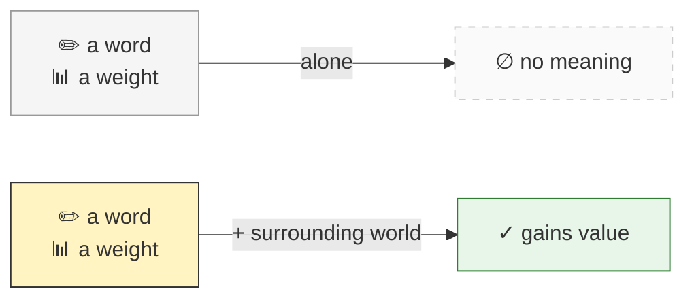
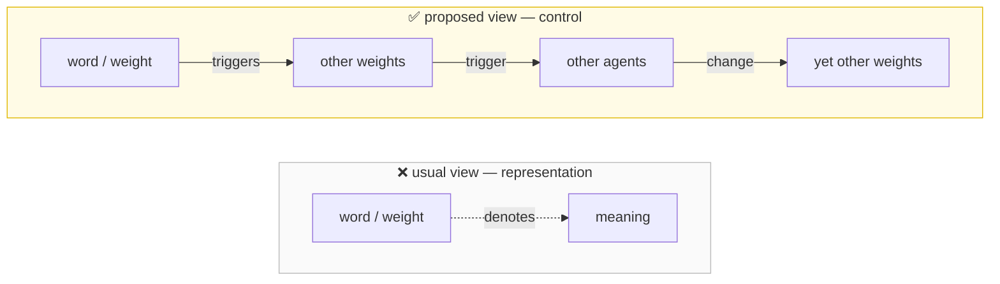
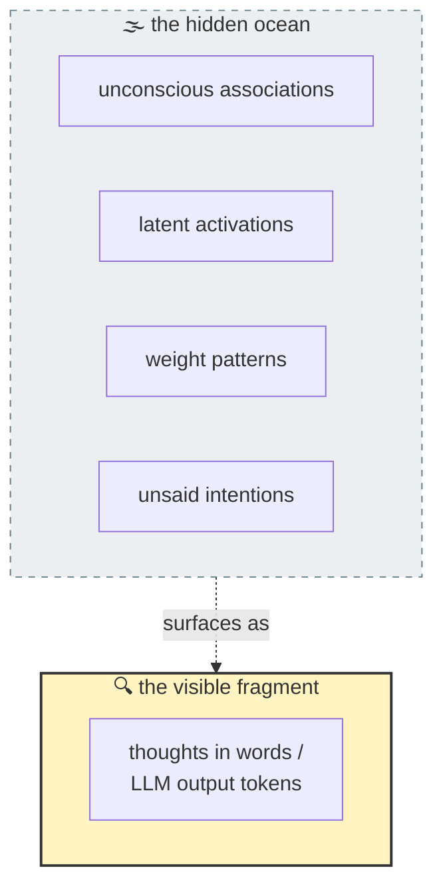
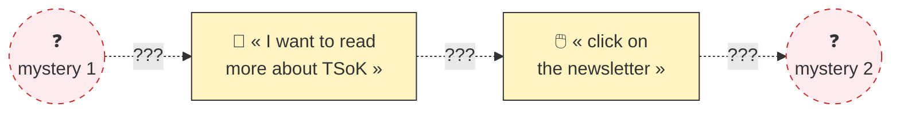
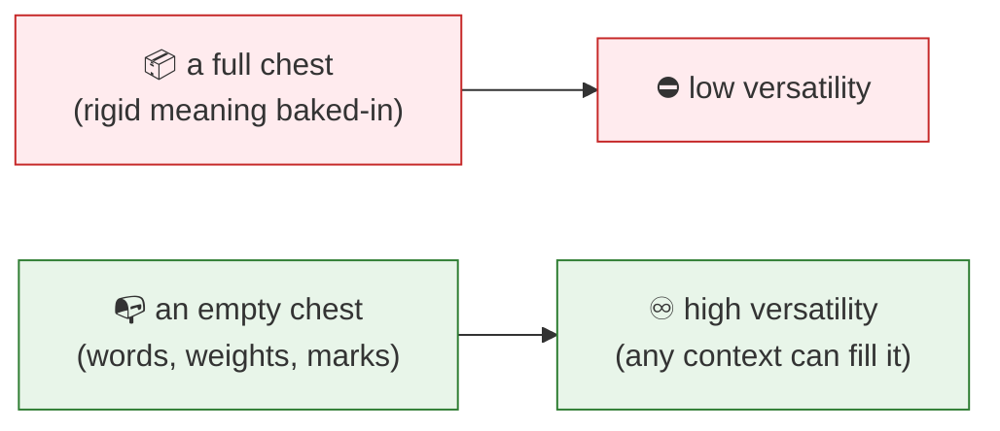

Language, which we use to convey knowledge, builds things in our minds. Large Language Models build weights activation chains in their transformers head. Yet words and weights themselves can't be the substance of knowledge. They have no meaning by themselves. They need context, a world to be surrounded by to gain value.

In fact, we can say they're only special sorts of marks.

If we're to understand how language works when used for knowledge, or if we are to understand what knowledge does to LLMs, we must discard the usual view that language and weights denotes, represents ou designates. Rather, their function is to **control**. Each word, each weight makes various weights in LLMs' mind, and then various agents to change what others' LLMs weights or others agents do.

For if we want to understand how knowledge interacts with LLMs, we must never forget that our thinking-in-words, and that the output of any LLMs reveals only a **fragment** of its internal mind's activity.

We often seem to think in words, and we think LLMs think in words. Yet, as we do this with no conscious sense of where and why those words originate, we don't know where and why LLMs react they way they do. Our inner monologues, and the mechanistic thoughts inside transformers proceed without any effort, deliberation, or sense of how they're done.

Now... you might argue that you do know what brings those words to mind : they express your ideas and intentions. But, once again, do you know where and why your intentions come and go ?

Let's take a simple example : suppose, for example, that at a certain moment you find you want to read more about "The Society of Knowledge" series of post. Then, naturally, you'd look for others article of The Society of Knowledge series. And this involves **two mysteries** :

1. What made you want read more about The Society of Knowledge ? Was it simply that you became tired of reading LLM generated posts online ? Was it because you remembered that your boss asked you about knowledge management ? Whatever reasons come to mind, you still must ask what led to them. The further back you trace your thoughts, the vaguer seem those casual chains. It is the same with LLMs.
2. The other side of the mystery is that we are equally ignorant of how we respond to our own intentions. Same for LLMs. Given a desire to read more about "The Society of Knowledge", what let you to the thought of "click on the newsletter" ? You only know that first you thought, "I want to read more" and then "where to click on the newsletter ?"

We're all so used to this that we regard it as completely natural. Yet, we have barely any sense of why each thought follows the last, and so does LLMs when they trigger weights. What connects idea of "reading more" with the idea of "clicking" ? Does it involve some sort of less direct connection, not between those state themselves, but only between some signals that somehow represent those states ? Or is it the product of yet more complex mechanisms ?

Our introspective abilities are too weak, just like self-observation of LLMs internal thoughts, to answer such questions. The words we think, the weights it triggers, seem to hover in some insubstantial interface or, in some latent space, wherein we understand neither the origins of the symbol-signs that seem to express our desires nor the destinations wherein they lead to actions and accomplishments.

This is why words, images and LLMs seem so magical: they work without our knowing how or why. At one moment a word can seem enormously meaningful; at the next moment it can seem no more than a sequence of sounds. And this is as it should be. **It is the underlying emptiness of words, weights, than gives them their potential versatility. The less there is in a treasure chest, the more you'll be able to put in it.**

